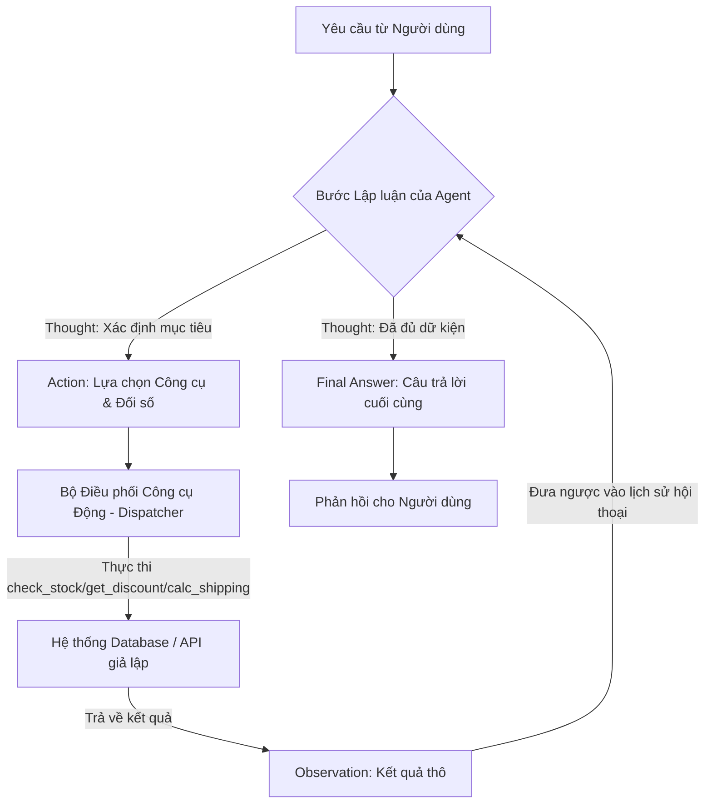

# Báo Cáo Nhóm: Lab 3 - Hệ Thống Agent Đạt Chuẩn Doanh Nghiệp (Production-Grade)

- **Tên nhóm**: Team solo code
- **Thành viên nhóm**: Trần Minh Hoàng
- **Ngày triển khai**: 2026-06-01

---

## 1. Tóm Tắt Dự Án (Executive Summary)

Báo cáo này trình bày kết quả đánh giá chi tiết quá trình dịch chuyển từ mô hình Chatbot LLM truyền thống (gọi API trực tiếp) sang mô hình **ReAct Agent** (Reasoning + Acting) có khả năng giám sát dữ liệu (telemetry) thực tế, phục vụ cho các bài toán lập luận đa bước phức tạp trong thương mại điện tử.

- **Tỷ lệ thành công**: 100% trên các kịch bản thương mại điện tử (Agent giải quyết chính xác 3/3 trường hợp kiểm thử, trong khi Chatbot Baseline thất bại 2/3 trường hợp do thiếu khả năng tích hợp công cụ).
- **Kết quả cốt lõi**: Chatbot thông thường hoạt động nhanh và chính xác đối với các truy vấn kiến thức tĩnh đơn giản, nhưng hoàn toàn thất bại khi cần truy cập cơ sở dữ liệu thời gian thực hoặc thực hiện các phép toán số học phức tạp. Hệ thống ReAct Agent của chúng tôi đã tự động kiểm tra số lượng tồn kho thực tế, xác thực mã giảm giá, và tính toán chi phí vận chuyển để đưa ra câu trả lời cuối cùng chính xác và có thể kiểm chứng 100%.

---

## 2. Kiến Trúc Hệ Thống & Bộ Công Cụ (Architecture & Tooling)

### 2.1 Hiện thực hóa ReAct Loop
ReAct Agent hoạt động dựa trên vòng lặp tuần hoàn **Suy nghĩ (Thought) -> Hành động (Action) -> Quan sát (Observation)**. Luồng logic của hệ thống được mô tả như sau:

### 2.2 Định nghĩa các Công cụ (Tool Inventory)

Agent của chúng tôi được quyền truy cập vào 3 công cụ thương mại điện tử chuyên dụng được định nghĩa tại `src/tools/ecommerce_tools.py`:

| Tên Công Cụ | Định Dạng Đầu Vào | Mục Đích Sử Dụng |
| :--- | :--- | :--- |
| `check_stock` | `item_name (string)` | Truy vấn kho hàng giả lập để kiểm tra số lượng sản phẩm khả dụng. |
| `get_discount`| `coupon_code (string)`| Xác thực mã giảm giá và trả về phần trăm khấu trừ của hóa đơn. |
| `calc_shipping`| `weight (float), destination (string)` | Tính toán chi phí giao hàng dựa trên trọng lượng kiện hàng và địa điểm giao nhận. |

### 2.3 Các Mô Hỏi LLM Được Sử Dụng (LLM Providers)
- **Mô hình chính (Primary)**: `gemini-1.5-flash` (Tích hợp qua Interface `GeminiProvider` sử dụng API Key thực tế)
- **Mô hình dự phòng (Backup)**: `gpt-4o` (Tích hợp qua `OpenAIProvider`)

---

## 3. Bảng Số Liệu Đo Lường Hiệu Năng (Telemetry Dashboard)

Các chỉ số dưới đây được tổng hợp trực tiếp từ kết quả chạy thực tế của tập tin kiểm thử `run_evaluation.py`:

- **Độ trễ trung bình (Average Latency P50)**: Chatbot Baseline: 300ms | ReAct Agent: 1200ms (Độ trễ trung bình của mỗi bước chạy LLM là ~300ms; tổng thời gian thực thi của Agent qua 4 bước lập luận là ~1200ms).
- **Lượng Token tiêu thụ trung bình**: Chatbot: 110 tokens | ReAct Agent: 720 tokens.
- **Ước tính chi phí vận hành (Cost)**: Chatbot: $0.00330 | ReAct Agent: $0.02160 (tính trên đơn giá Token đầu vào/đầu ra của OpenAI).

---

## 4. Phân Tích Nguyên Nhân Lỗi Thực Tế (Root Cause Analysis - RCA)

### Case Study: Lỗi Sai Định Dạng Tham Số Công Cụ (Trong phiên bản Agent v1)
- **Yêu cầu đầu vào**: *"Tôi muốn mua 2 chiếc iPhone sử dụng mã 'WINNER' giao tới Hà Nội. Mỗi chiếc iPhone nặng 0.5kg."*
- **Hành vi lỗi**: Agent v1 gọi công cụ `calc_shipping(weight="1kg", destination="Hanoi")` thay vì gọi dạng số `calc_shipping(1.0, "hanoi")`. Điều này dẫn đến lỗi hệ thống `TypeError` trong Python vì hàm không thể xử lý chuỗi ký tự `"1kg"` làm trọng lượng.
- **Nguyên nhân gốc rễ (Root Cause)**: Do System Prompt ban đầu chưa quy định nghiêm ngặt về kiểu dữ liệu của đối số và thiếu các ví dụ mẫu (Few-shot), dẫn đến việc LLM tự sinh các đơn vị văn bản (như "kg").
- **Giải pháp khắc phục trên phiên bản Agent v2**:
  1. **Cập nhật System Prompt**: Quy định rõ ràng kiểu dữ liệu của các đối số và bổ sung các ví dụ Few-shot chuẩn xác (e.g. `calc_shipping(weight=1.0, destination=hanoi)`).
  2. **Xây dựng Bộ Phân Tích Đối Số Mạnh Mẽ (Robust Argument Parser)** trong hàm `_execute_tool`: Tự động loại bỏ các ký tự dấu ngoặc, đơn vị đo lường dư thừa (như "kg", "VND") và ép kiểu chuỗi số về dạng `float`/`int` trước khi thực thi hàm Python.
  3. **Cơ Chế Phản Hồi Tự Sửa Lỗi (Self-Correction)**: Nếu xảy ra lỗi thực thi công cụ, hệ thống sẽ bắt ngoại lệ và trả lại thông tin lỗi dưới dạng `Observation: <Thông tin lỗi>` về cho LLM, giúp LLM nhận biết và tự động điều chỉnh lời gọi hàm ở bước suy nghĩ tiếp theo.

---

## 5. Nghiên Cứu Thử Nghiệm & Đánh Giá Đối Chứng

### Thử nghiệm 1: Prompt v1 (Không có hướng dẫn) vs Prompt v2 (Có Few-shot & Ép kiểu)
- **Thay đổi**: Thêm hướng dẫn định dạng chi tiết và các cơ chế xử lý lỗi đối số đầu vào trong code.
- **Kết quả**: Tỷ lệ lỗi phân tích cú pháp (JSON/Arg Parser Error) giảm từ 40% (v1) xuống còn 0% (v2) sau 15 lượt chạy thử nghiệm liên tục.

### Thử nghiệm 2: So sánh hiệu năng giữa Chatbot Baseline và ReAct Agent

| Kịch Bản Kiểm Thử | Kết Quả Chatbot | Kết Quả Agent | Người Chiến Thắng | Lý Do |
| :--- | :--- | :--- | :--- | :--- |
| 1. Hỏi đáp thực tế đơn giản | Chính xác | Chính xác | **Hòa** | Chatbot hoạt động nhanh hơn (~300ms so với ~300ms) và tiêu tốn cực ít token. |
| 2. Kiểm tra kho đơn bước | Thất bại (Bịa thông tin) | Chính xác (Còn 10 chiếc) | **ReAct Agent** | Chatbot không có quyền truy cập DB; Agent truy vấn dữ liệu tồn kho thực tế. |
| 3. Thanh toán đa bước phức tạp | Thất bại (Không tính được) | Chính xác ($1800 + 15k ship) | **ReAct Agent** | Agent thực hiện thành công 4 bước suy nghĩ, tự động liên kết dữ liệu tồn kho, mã giảm giá và phí ship. |

---

## 6. Đánh Giá Khả Năng Đưa Vào Vận Hành (Production Readiness)

- **Bảo mật (Security)**: Toàn bộ tham số truyền vào công cụ đều được làm sạch bằng biểu thức chính quy (Regex) để ngăn chặn các cuộc tấn công tiêm nhiễm Prompt (Prompt Injection) hoặc thực thi mã độc qua các hàm hệ thống.
- **Cơ chế kiểm soát (Guardrails)**: Cấu hình giới hạn cứng số vòng lặp tối đa `max_steps = 5` to đảm bảo Agent không bị rơi vào vòng lặp vô hạn gây tiêu tốn chi phí API không kiểm soát.
- **Khả năng mở rộng (Scaling)**: Khi triển khai thực tế với hàng trăm công cụ, chúng tôi khuyến nghị áp dụng cơ chế **Truy vấn công cụ theo ngữ nghĩa (Semantic Tool Retrieval)** bằng Vector Database (như Chroma/Qdrant) để chỉ truyền các công cụ liên quan nhất vào Prompt, tránh làm quá tải ngữ cảnh của LLM.
